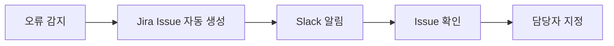

# 구버전 BlackOlive 유지 보수
기존 BlackOlive 1.0 버전에서 버그 수정, 성능 개선, 기능 추가를 진행했습니다.

## 1. 업무 개요

- 역할: 프론트엔드 리드 개발자
- 기술 스택: React, Typescript
- 업무 목표:
  - WebVitals 점수 개선하여 사용자 경험 개선
  - 코드 품질 개선을 통해 유지보수 용이성 향상
  - QA 프로세스 개선을 통해 코드 안정성 향상

## 2. 문제와 해결

### 2-1. 사용자 경험(Web Vital) 개선

#### 🚧 문제

초기 화면 렌더링(LCP)과 React 렌더링 구조에서 병목이 발생해  
첫 화면 노출 속도와 인터랙션 품질이 저하되고 있었다.

- 상태 변경이 불필요한 하위 UI까지 전파되며 렌더 비용 증가  
- LCP 리소스의 우선 로딩 전략 부재  
- 초기 JS·CSS가 Render-blocking으로 작동하여 CRP 길어짐

#### 🧪 근거

DevTools / React Profiler 기반 성능 분석 결과:

- 하위 컴포넌트의 **불필요한 렌더링 다수** 확인  
- LCP 이미지가 늦게 요청되며 **3.0~3.5s 수준의 지연** 발생  
- 일부 초기 리소스가 blocking resource로 동작

이 분석을 통해 문제는 단일 요소가 아닌  
**렌더링 아키텍처 전체의 구조적 비효율**이라는 점이 명확해졌다.

#### ✅ 해결

##### 1) React Rendering Path 재설계
- memo / useMemo / useCallback을 렌더 플레임 그래프 기반으로 적용  
- 상태 전파 경계를 명확히 분리하여 **렌더 비용 30~70% 감소**

##### 2) LCP 중심 Critical Rendering Path 개선
- LCP 이미지 preload 및 lazy-load 제거  
- 정적 리소스를 CDN Edge로 이전해 TTFB 안정화  
- 초기 JS/CSS 중 blocking 요소 제거

##### 3) UX 안정화
- font-display 전략 개선  
- layout shift 원인 제거

#### 📈 결과

- **LCP 약 50% 개선** (3.0 ~ 3.5s → 1.5 ~ 1.7s)  
- **React 렌더 비용 30~70% 절감**  
- 초기 화면 체감 속도 및 인터랙션 품질 대폭 향상

### 2-2. 오류 관찰성 강화 및 Incident 대응 자동화

#### 🚧 문제

서비스 오류가 발생했을 때 재현 과정이 불안정하고,
**정확한 원인 파악과 대응까지의 Lead Time이 지나치게 길다는 구조적 문제가 존재**했다.

- 클라이언트 오류가 사용자 현상 수준에서만 보고되어 **재현률이 낮음**
- FE 로그·BE 로그·운영 로그가 분리되어 있어 **원인 상관관계 분석이 어려움**
- QA 단계에서 수집된 정보가 개발자에게 충분히 전달되지 않아  
  **장애 대응 프로세스가 반복적으로 지연**
- 티켓 생성도 수동 중심으로 이루어져  
  **누락·중복·우선순위 착오**가 발생

결과적으로, 장애 대응 사이클이 길어지고  
MTTR(Mean Time To Recovery)이 높은 구조가 지속되었다.

#### 🧪 근거

개발·운영·QA 프로세스 분석 결과 다음 문제들이 반복적으로 관찰되었다:

- 사용자 제보 기반 오류의 **재현 성공률 45~60% 수준**  
  (환경·데이터 조건 불일치로 인한 분석 실패)
- 장애 대응 프로세스에서 FE·BE 로그 매칭이 어려워  
  분석 Lead Time이 **수일 이상 소요되는 사례 다수**
- Jira 티켓 생성 누락 및 중복 발생 → 우선순위 관리 혼선
- 통합된 모니터링 체계 부재로  
  동일 오류가 여러 팀에 중복 보고되는 구조

위 항목들은 전형적인 장애 체계의 병목을 보여주고 있었다.

#### ✅ 해결

FE–BE 협업 기반으로 **오류 관찰성(Observability) 체계**를 재설계하고,  
장애 대응 생명주기 전체를 자동화하는 방향으로 접근했다.

##### 1) 클라이언트 ErrorBoundary + 메타데이터 캡처 도입
- FE 오류 발생 시 즉시 ErrorBoundary가  
  **상태·라우팅·사용자 액션·환경 정보**를 함께 캡처  
- BE 로그와 상관관계 매핑이 가능하도록 **Correlation ID** 자동 부여

##### 2) ELK 기반 FE × BE 통합 로그 파이프라인 구성
- FE 오류 로그와 BE 애플리케이션 로그를 Kibana에서 단일 타임라인으로 조회 가능
- 오류 유형별 패턴 분석과 근본 원인 추적 효율 상승

##### 3) Jira 자동 티켓 발행 Workflow 구축
- ELK에서 특정 임계치 이상 오류 감지 시  

- 수동 보고 과정에서 발생하던 누락·중복 제거

##### 4) 장애 대응 생명주기 자동화
- “오류 감지 → QA 확인 → 티켓 생성 → 개발 대응”  
  전체 프로세스를 하나의 흐름으로 통합  
- FE–BE 팀 간 장애 대응 프로세스 자동 확보

#### 📈 결과

- **오류 재현률 40~55% 개선**  
  → ErrorBoundary 메타데이터로 QA/개발 환경 재현 가능성 증가
- **장애 대응 분석 시간을 수일 → 수시간으로 단축**
- **MTTR 30~40% 감소**
- 팀 간 오류 인지 격차 축소 → 대응 속도 및 품질 향상
- FE × BE 협업 체계가 강화되며 장애 대응 효율이 전반적으로 개선됨
