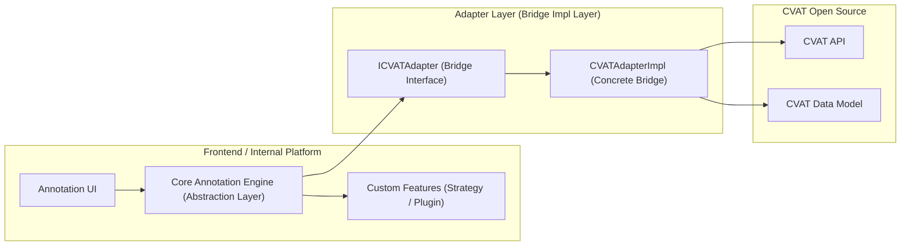

# BlackOlive V2

기존 플랫폼의 구조적 문제를 해결하기 위해, 새로운 플랫폼을 구축하였습니다.

## 1. 업무 개요

- 역할: 프론트엔드 리드 개발자
- 기술 스택: React, Typescript
- 업무 목표:
  - 외부 오픈소스 변경에 흔들리지 않는 유연한 구조를 목표로 아키텍처 재설계
  - 개발 생산성·DX 고도화
  - 반복적인 프로젝트별 요구사항을 플랫폼 레벨로 추상화·내재화하여, 개발 생산성과 유지보수 효율을 고도화.

## 2. 문제와 해결

### 2-1. 오픈소스 의존 구조 개선

#### 🚧 문제

기존 플랫폼은 CVAT(라벨링 오픈소스)와 직접적으로 강하게 결합되어 있는 구조였다.
이로 인해 다음과 같은 구조적 문제가 지속적으로 발생했다.
	- 오픈소스 측에서 버전 변경, 기능 Deprecated, API 변동, 신규 기능 추가가 발생하면
플랫폼 전체가 영향을 받아 업데이트 비용이 과도하게 증가
	-	업데이트를 제때 적용하지 못해 오픈소스 기능을 충분히 활용하지 못하고,
플랫폼이 점차 내부적으로만 진화하는 갈라파고스 구조로 변질
	-	장기적으로 유지보수성·확장성·팀 생산성 모두 하락,
기술 부채가 누적되어 개선이 어려워짐

#### 🧪 근거

플랫폼 내부의 진단과 운영 경험을 통해 다음과 같은 근거를 확인할 수 있었다.
	-	CVAT API 변경 시 마다 플랫폼 곳곳에서 레거시 코드가 연쇄적으로 깨짐 → 수정 범위 예측 불가능
	-	신규 기능을 활용하려 해도 플랫폼 레이어와 CVAT가 1:1 결합되어 있어 기능 추가보다 기존 결합 해소에 더 많은 시간이 소모됨
	-	실제 운영 중 업데이트를 일시 중단한 기간이 길어지며, CVAT 최신 버전과 1년 이상 차이 발생 → 보안 패치·성능 개선 요소를 흡수하지 못함
	-	개발자 온보딩 시 CVAT 구조를 파악 하더라도 블랙올리브와 강하게 결합된 구조로 인해 학습 비용이 증가하고 팀 생산성이 하락하였다.

이러한 사실은 플랫폼이 CVAT라는 오픈소스를 기반으로 하면서도
정작 오픈소스의 장점을 활용하지 못하고 업데이트 비용만 커지는 구조적 한계를 명확히 보여주었다.

#### ✅ 해결

**Adapter Layer로 인터페이스 표준화** 
- 브릿지 패턴의 개념을 적용하여, 추상화된 인터페이스를 통해 구현과 사용을 분리
- CVAT 및 내부 플랫폼 간의 중간 추상 계층(Adapter Layer)을 설계
- 모든 외부 연동은 Adapter Layer를 통해 추상화된 인터페이스를 통해 이루어지도록 강제
오픈 소스의 변경이 발생해도 영향 범위를 Adapter Layer로 제한
- 구조도

#### 📈 결과

**오픈소스 변경 영향도 70~90% 감소** 
변경 사항이 Adapter Layer 내부로 완전히 캡슐화되어 Core 영향 없음 
**기능 추가 속도 2~3배 향상** 
새로운 기능(Keypoint, Comment 등)을 플랫폼 Core 수정 없이 Adapter/Plugin 단위로만 추가 가능 
**플랫폼 확장성 확보** 
오픈소스 변경이나 신규 기능 요구사항이 생겨도 Core는 그대로 두고 Adapter/Plugin만 교체 가능 → 장기적으로 갈라파고스화 문제 해소

### 2-2. 개발 생산성·DX 고도화

#### 🚧 문제

기존 FE 개발 환경은 Webpack 기반의 복잡한 로더 체인, 느린 HMR, 중첩된 HOC 패턴 등으로 인해
빌드 병목 · 느린 피드백 루프 · 낮은 코드 재사용성이 지속적으로 발생하고 있었다.
	-	Webpack의 HMR 속도가 느려 개발 생산성이 저하되었고 병렬성 낮은 빌드 파이프라인으로 인한 빌드 시간이 길어졌다.  
	-	중첩된 HOC 기반 구조로 인해 로직 위치가 분산되고 재사용 어려움
	-	코드 컨벤션 부재로 리뷰 품질 편차 존재, 리뷰 비효율 증가

이로 인해 개발 속도·조직 생산성이 저하되는 구조였다.

#### 🧪 근거
**Webpack 기반 빌드 성능 저하의 구조적 한계** 
-	번들링 중심 아키텍처
Webpack은 모든 의존성을 그래프로 분석해 하나의 번들 또는 여러 청크를 생성하는 방식이다.
파일 한 개만 수정해도 전체 그래프 재분석 → 번들 재생성이 필요해 변경 비용이 크다.
-	CommonJS(Require) 의존성으로 인한 느린 처리
Webpack 생태계는 여전히 CJS 패키지가 많아,
정적 분석 최적화(Treeshaking·Lazy load)가 제한적이며 추가 변환 비용이 발생.
-	로더 체인(Loader Chain) 과다 사용
Babel, TypeScript, CSS loader, 각종 플러그인이 직렬 처리되며 빌드 병목 생성.
병렬 처리 옵션은 한계가 있고, 캐싱 활용도 제한적이었다.
-	HMR(Hot Module Replacement) 갱신 지연
HMR은 변경된 모듈만 교체하는 방식이지만,
Webpack은 변경 감지 후에도 재번들링 단계가 필요해 반응 속도가 느렸다.
실제로 큰 프로젝트에서는 수 초 단위 딜레이가 반복됨.

**HOC 기반 아키텍처의 비효율** 
-	중첩된 HOC(Higher-Order Component) 구조는 컴포넌트 트리를 깊게 만들고,
React DevTools 상에서도 헬퍼 컴포넌트들이 다량 노출되어
렌더 트리 분석이 어려워 디버깅 비용 증가.
-	HOC는 Wrapper가 새로운 컴포넌트를 생성하기 때문에
의도치 않는 불필요한 리렌더 발생 가능성이 높다.
특히 prop 변경 추적이 어렵고 HOC 간 결합도가 올라가 DX(Developer Experience) 가 급격히 악화됨.
-	로직 분리가 Component 단위로만 이뤄져 있어
공통 로직을 재사용할 때 HOC를 계속 쌓아야 했고,
결과적으로 로직 중복 & 유지보수 비용 증가로 이어짐.

**코드 품질 저하의 구조적 한계** 
- 코드 컨벤션 부재로 리뷰 품질 편차 존재, 리뷰 비효율 증가
- 리뷰 중 스타일·포맷 관련 코멘트가 30~40% 비중을 차지
- Git hook 부재로 포맷 오류·미완성 코드가 PR에 지속적으로 유입됨

#### ✅ 해결

**Webpack → Vite로 전환하여 빌드/개발 성능 구조 개선** 
- ESBuild 기반 초고속 빌드 파이프라인 도입
    - Vite는 번들링 없이 ESBuild로 소스 변환을 수행하여 기존 Babel 대비 10~100배 빠른 변환 속도 확보.
- Native ESM 기반 개발 서버 구조
    - 변경된 모듈만 브라우저에 직접 제공(Non-bundled Dev Server) 하므로,
전체 그래프를 갱신할 필요가 없어 HMR이 즉시 반응함. → 실제 HMR 속도 80% 이상 개선
- Rollup 기반 Production 빌드 최적화
    - 배포 빌드는 Rollup을 사용해 트리쉐이킹 품질이 향상되고
불필요한 번들이 제거되며 번들 크기 감소 사례도 경험.

**HOC 기반 구조 → Custom Hook 기반 로직 모듈 패턴으로 전환** 
-	View와 로직을 완전히 분리하는 구조로 변경
    - UI는 순수 Presentational Component로 남기고,
모든 비즈니스 로직은 Custom Hook으로 이전해
재사용성·가독성·테스트 용이성 모두 개선.
- 불필요한 리렌더링 제거
    - Hook 내부에서 useMemo, useCallback, React.memo 등
메모라이징 전략을 체계적·일관적으로 적용해
렌더 경로(Render Tree)가 단순해지고 성능 안정성 확보.
-	로직 모듈화를 통한 복잡도 제어
    - 여러 기능이 독립 모듈(Hook)로 나뉘어
장애 영향을 최소화하고 기능 단위 테스트가 용이해짐.
    - DevTools 가독성 및 DX 대폭 향상
    - HOC로 인해 감춰져 있던 실제 UI 컴포넌트 트리 최상위에 위치해 디버깅 효율 개선.

**코드 품질 개선** 
- ESLint + Prettier 도입으로 팀 레벨에서 표준 컨벤션을 정의·통합해 코드 품질 일관성 확보
- Husky + Lint-staged 구조 도입으로 코드 포맷 오류·미완성 코드를 PR 단계에서 제거하여 리뷰 품질 향상
- 결과적으로 리뷰 품질 편차 감소, 리뷰 리드타임 감소(약 30% 감소)

### 2-3. 반복적인 프로젝트별 요구사항을 플랫폼 레벨로 내재화

#### 🚧 문제
신규 프로젝트가 시작될 때마다,
각 프로젝트 특성에 맞는 커스텀 키포인트·작업 규칙·코멘트 기능 등을 매번 개별 개발해야 하는 구조였다.
- 동일 패턴의 요구사항임에도 프로젝트마다 중복 개발 발생
- 요구사항 변경 시 담당 개발자의 맥락 의존도가 높아 유지보수 비용 증가
- 연구원(실제 도메인 전문가)이 즉시 설정할 수 없는 구조라 생산성이 떨어짐
- 결과적으로 신규 프로젝트 착수 속도가 느리고, 개발 투입 인력이 과도하게 필요함

#### 🧪 근거
- 프로젝트당 1명 수준의 FE/BE 개발 리소스가 반복 투입됨
- 유사 요구사항(키포인트 정의, 동작 규칙, 코멘트 구조 등)이 프로젝트별로 중복 구현됨
- 커스텀 기능 수정 요청이 발생하면 개발자가 직접 대응해야 하므로 리드 타임 증가
- 프로젝트 수가 증가할수록 시스템 일관성 저하 및 유지보수 난이도 상승
- 실제로 한 프로젝트에서 하드 코딩한 키포인트의 좌표 누락으로 데이터 소실 사례 발생 → 필연적 개발 오류 발생

#### ✅ 해결

**커스텀 키포인트의 플랫폼화** 
- 사용자가 대시보드에서 프로젝트에 맞는 커스텀 키포인트를 설정할 수 있도록 플랫폼화
- 해당 키포인트는 런타임 단계에서 선택될 수 있도록 코드베이스에서 전략 패턴으로 분리하여 적용
- 연구원이 UI상에서 키포인트 형태 및 순서를 설정할 수 있도록 구현 → 개별 개발이 필요했던 정의를 자동화

**코멘트, 작업 규칙의 모듈화 및 표준화** 
- 코멘트/Annotation 기능을 별도 모듈로 분리하여 플랫폼 전역에서 재사용 가능하게 구성
- 각 프로젝트 별 필요 기능을 플러그인 형태로 제공하여 프로젝트별로 커스터마이징 가능하게 구성

#### 📈 결과
- 프로젝트별 FE/BE 개발 투입률 60~80% 감소
- 기능 일관성 확보 및 유지보수 비용 감소
- 플랫폼 확장성 강화 → 프로젝트를 수행하며 개선된 기능, 추가 기능을 플랫폼에 적용할 수 있는 구조 확보