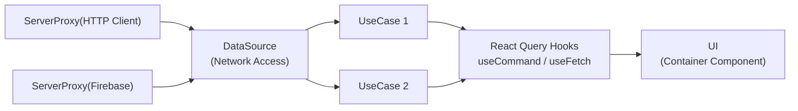

# HAiO - L2E 뮤직 플랫폼 (FE 개발 & BE 지원)

AI 기반 플레이리스트 생성/청취와<br />
Solana 토큰 기반 보상 구조를 결합한 L2E 뮤직 웹 서비스 개발.<br />
FE 주도로 다중 네트워크 연동 구조, 서버리스 운영 기능, 실시간 AI 생성 UX를 설계·구축하고<br />
Web3 핵심 개발에 BE 리소스를 집중할 수 있도록 서비스 기반을 정비함.<br />

## 1. 업무 개요

- 역할: 프론트엔드 개발, BE 지원
- 기술 스택: React, Typescript, Firebase, Solana
- 업무 목표:
  - Web3·AI 기반 뮤직 플랫폼의 안정적 MVP 구조 설계 및 구축
  - 서버리스 기반 운영 기능 FE 주도 내재화
  - 효율적인 배포 프로세스 구축

## 2. 문제와 해결

### 2-1. 안정적인 프론트엔드 아키텍처 구축

#### 🚧 문제

HAiO 서비스는 Firebase·Server API·Solana(Web3) 등
성격이 다른 데이터 소스를 동시에 다뤄야 했고,
각 소스마다 인증·에러·재시도 규칙이 달라
기능이 늘수록 UI와 네트워크 로직이 함께 비대해질 위험이 컸다.

또한 AI 기반 플레이리스트/음악 생성 기능까지 결합되면서
요청–응답–상태 전이가 복잡해져
페이지 단위 개발마다 비동기 로직이 중복될 가능성이 높았다.

#### 🧪 근거

- 네트워크별 인증/에러 처리 방식이 달라, 중복 코드와 API 정책 불일치가 발생할 수 있는 구조 설계될 수 있었음.
- 해킹에 쉽게 노출되는 Web3 서비스 특성상, API의 인증 프로세스 추가 및 변경이 지속적으로 발생하였음.
- Container/Presentational 구조로 설계하여 API 처리와 도메인 규칙들이 UI Layer로 노출될 경우 테스트/확장/유지 보수 비용이<br />
크게 증가할 것이라고 예상.

#### ✅ 해결

- **tsyringe 기반 IoC/DI**로 네트워크 접근 책임을 분리하고
  테스트 가능한 구조로 정리
- **UseCase-DataSource Layer**를 도입해
  토큰 처리·에러 규칙·재시도 정책을 도메인 계층에서 중앙화

- React Query를 기반으로
  **useCommand / useFetch 형태의 커스텀 훅 추상화**를 적용해
  UI는 상태 구독 중심으로 단순화

- API Flow 아키텍처 요약
```ts
// 1) ServerProxy: 네트워크 표준화 (auth/refresh/baseURL)
type HttpClient = {
  get<T>(url: string, config?: unknown): Promise<T>;
  post<T>(url: string, body?: unknown, config?: unknown): Promise<T>;
};

function createHttpClient(opts: {
  baseURL: string;
  withAuth: boolean;
  refresh?: () => Promise<string | null>;
}): HttpClient {
  // 실제 구현에서는 axios + request/response interceptors 구성
  // - Authorization 주입
  // - 401 시 refresh 후 재시도
  // - timeout/JSON 표준 헤더 적용
  return {} as HttpClient;
}

// 2) DataSource: API 계약 단위로 I/O 캡슐화
class ApiDataSource {
  constructor(
    private readonly api: HttpClient,
    private readonly apiNoAuth: HttpClient
  ) {}

  login(req: { code: string }) {
    return this.apiNoAuth.post<{ accessToken: string }>("/auth/login", req);
  }

  verifyAuth(req: { signature: string }) {
    return this.api.post<{ ok: boolean }>("/auth/verify", req);
  }

}

// 3) UseCase: 비즈니스 실행 단위
interface FetchUseCase<T, P> {
  key(params?: P): unknown[];
  execute(params: P): Promise<T>;
}

class VerifyAuthUseCase implements FetchUseCase<{ ok: boolean }, { signature: string }> {
  constructor(private readonly ds: ApiDataSource) {}
  key() { return ["verify-auth"]; }
  execute(params: { signature: string }) {
    return this.ds.verifyAuth(params);
  }
}

// 4) Hooks: UseCase 기반 UI 호출 표준화
function useFetch<T, P>(uc: FetchUseCase<T, P>, params: P) {
  // 실제 구현에서는 React Query를 사용해
  // cache, staleTime, error boundary 전략을 통일
  return { data: undefined as T | undefined, isLoading: false };
}

```
```ts
// UI 사용 예시  *실제 코드에선 객체 생성 및 생성주기 관리는 tsyringe가 전담
const verifyAuthUC = new VerifyAuthUseCase(apiDataSource);

function AuthPage() {
  const { data, isLoading } = useFetch(verifyAuthUC, { signature: "..." });
  // UI는 UseCase 결과만 소비
}
```

#### 📈 결과
	-	Firebase·BE·Web3 Contract 등 이질적인 외부 통신을 DataSource 레이어로 통합하고 접근 규약을 표준화하여, 네트워크 변경·확장 시 영향 범위를 최소화하고 유지보수성과 확장성을 강화.
	-	Bot 대응을 위해 Cloudflare Turnstile 인증을 긴급 도입해야 하는 상황에서, UseCase 레이어에 고차 함수 기반 인증 데코레이터를 적용해 필요한 API에만 선택적으로 주입함으로써, 빠른 적용 속도와 변경 범위 통제(Selective Enforcement)를 동시에 확보.

### 2-2. Firebase 서버리스 기반 운영 기능 내재화

#### 🚧 문제

Web3 핵심 개발에 백엔드 리소스를 집중해야 하는 상황에서  
플랫폼 운영에 필요한 기능(로그인, 사용자 정보, 추첨, 포인트 계산 등)을  
기존 방식대로 BE가 모두 담당하면 병목과 일정 리스크가 크게 발생할 가능성이 있었다.

- 운영 기능도 결국 서비스 안정성과 매출/리텐션에 직접 영향을 주는 핵심 경로였음
- 그러나 Web3 중심 로직과 운영 기능이 동일한 개발 파이프라인에 얽히면  
  릴리즈 우선순위 충돌, 리소스 분산, 일정 지연이 구조적으로 반복될 수 있는 상황

즉, **“운영 기능의 신속한 확장”과 “Web3 핵심 개발 집중”을 동시에 만족하는 구조**가 필요했다.

#### 🧪 근거

- 단순 운영 기능 변경이 Web3 개발 일정과 충돌할 가능성이 높았고  
  결과적으로 **백엔드 개발 대기 시간이 누적되는 구조**가 우려됨
- 고정 서버 중심의 대응은
  “평시 기준 비용 + 이벤트 대비 추가 증설”의 이중 비용 구조를 만들 가능성이 높았음
- Cloud Functions는 호출량/실행 시간 기반의 사용량 과금이며,
  월 기준 매력적인 영구 무료 구간이 있어
  운영성 기능을 서버리스로 흡수하기에 비용 효율이 높다고 판단. [비용 정책](https://cloud.google.com/functions/pricing-1stgen)

#### ✅ 해결

- 운영 기능을 Web3 핵심 API와 분리해  
  **릴리즈 단위와 변경 속도를 독립적으로 유지**
- 이벤트 기반(트리거/스케줄) 구조를 활용해  
  포인트 정산·추첨 처리 등 **비동기 운영 로직을 안정적으로 자동화**
- 로그인/사용자 정보/추첨/포인트 계산을  
  **Firebase Datastore + Cloud Functions 중심의 서버리스 플로우**로 설계해
  운영 기능을 FE 주도 구조로 내재화
- 이벤트 트래픽은
  **Functions 로그/메트릭 기반으로 호출량·오류율·지연을 빠르게 관측**하고,
  스파이크 구간에 대해 함수 리소스/설정(리전·타임아웃·메모리 등)을 조정하는 방식으로
  안정적인 확장 전략을 확보


#### 📈 결과

- Web3 핵심 개발 영역과 운영 기능의 릴리즈 충돌을 최소화해  
  **백엔드 개발 리소스 40~50% 수준 절감**에 기여
- MVP 출시 및 기능 확장 속도를 높여  
  **개발 일정 리스크를 구조적으로 낮추고 전반적인 제품 대응 속도 향상**
- 이벤트 트래픽을 **Functions 자동 확장 + 로그 기반 모니터링**으로 처리해 **비용 효율적 안정성 확보**


### 2-3. AI 생성·Web3 보상 흐름의 불확실성을 견디는 실시간 UX 설계

#### 🚧 문제

AI 음악 생성과 플레이리스트 경험은
지연·부분 응답·실패 같은 불확실성을 내재하고 있으며,
Web3 보상 로직은 RPC 실패·서명 검증·트랜잭션 컨펌 지연 등
외부 네트워크 요인의 영향을 크게 받는다.

#### 🧪 근거

- AI 작업은 Job 기반 비동기 구조에서
  상태 피드백이 없으면 이탈이 증가하는 일반적 패턴
- Solana RPC는 네트워크 상황에 따라 실패/지연 변동 폭이 크며,
  재시도 정책 부재 시 사용자 신뢰에 직접 영향

#### ✅ 해결

- **Prompt → Job → Stream** 형태의 생성 파이프라인을 정리하고
  **SSE 기반 실시간 UI**로 생성 상태를 단계별로 가시화
- Solana RPC/Signature 검증 로직에
  **retry/backoff 전략**을 적용하여 실패 내성을 확보
