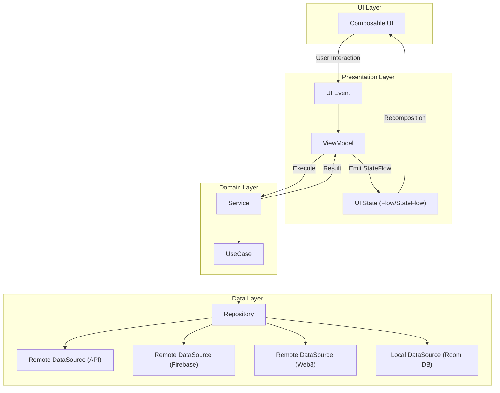
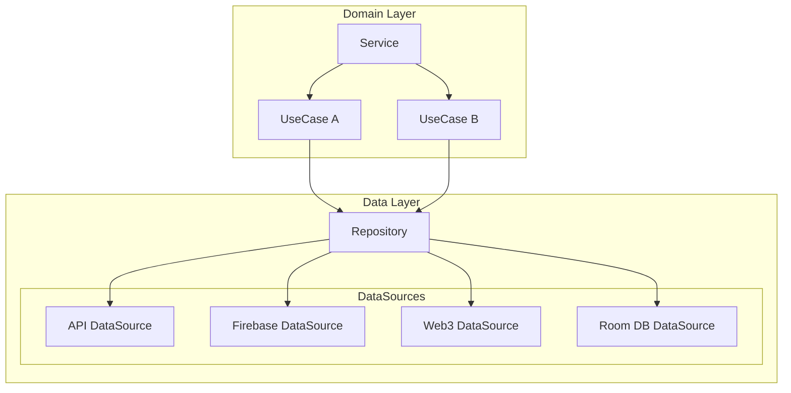

# Tracks - Web3 기반 L2E 안드로이드 앱 신규 개발

EVM 기반 LABEL AI 토큰을 사용하는 L2E(Listen-to-Earn) 모델을 실제 사용자 환경에서 구현하기 위해, Android 앱을 제로베이스에서 신규 설계·구축한 프로젝트입니다.
Web 서비스와 동일한 도메인 모델과 데이터 흐름을 Android 환경에 맞게 재구성하면서, 모바일 UX에 최적화된 구조를 수립하고 빠른 개발 사이클을 확보하는 데 집중했습니다.

## 1. 업무 개요

- 역할: 안드로이드 개발
- 기술 스택: Kotlin, Android, Jetpack compose
- 업무 목표:
  - 3개월 내 안드로이드 앱 출시를 위한 개발 구조 설계
  - 복잡한 멀티 데이터 소스(Firebase·API·Web3·Local DB)의 일관된 접근 계층 구축
  - 안정적인 오디오 스트리밍 경험 제공을 위한 미디어 엔진 설계

## 2. 문제와 해결

### 2-1. 단기간 내 앱 출시를 가능하게 하는 개발 생산성 확보

#### 🚧 문제

신규 Android 앱을 3개월 내 출시해야 하는 상황이었지만,
Android의 전통적인 View 기반 UI는 React와 달리 상태·레이아웃·이벤트가 분산된 명령형 구조를 사용해
초기 진입 장벽이 높고, 숙련되지 않은 개발자에게 빠르게 생산성을 내기 어려운 구조였음. 
또한 화면 구성·비동기 처리·데이터 접근 방식이 분리되어 있어
기능을 확장하거나 새로운 화면을 추가할 때마다 복잡도가 기하급수적으로 증가하는 문제가 존재. 
(→ React 기반 FE 경험을 가진 개발자에게는 더 큰 러닝 커브로 작용)

#### 🧪 근거
- Android View 시스템은 XML 레이아웃 + Fragment/Activity + LiveData 등
다중 계층이 얽혀 있어, 웹에서 익숙한 React 단일 UI 흐름과 달리 구조적 적응 비용이 컸음
- 기존 방식으로 3개월 내 신규 앱 전체를 구축하는 것은 속도·안정성 측면에서 리스크가 높다고 판단
- React처럼 직관적인 선언형 UI 흐름을 Android에도 적용하기 위한 구조적 대안이 필요했음

#### ✅ 해결
- Jetpack Compose 기반 선언형 UI 도입
    - React와 유사한 선언형 패러다임을 사용해 UI와 상태 흐름을 MVVM 구조로 정리함으로써
기존 View 시스템에서 발생하던 복잡한 레이아웃/상태 결합 문제를 제거.

- Hilt 기반 DI 구조 도입
    - 화면·도메인·데이터 레이어 간 의존성을 중앙에서 관리해
객체 생성·주입·테스트 환경 구성 비용을 크게 절감.
- Service, UseCase, Repository, DataSource 구조 정립
    - 비즈니스 로직을 도메인 계층에 위치시켜 화면 로직과 비즈니스 로직을 분리하고,
데이터 접근 로직을 데이터 계층에 위치시켜 화면 로직과 데이터 접근 로직을 분리함으로써
기존 View 시스템에서 발생하던 복잡한 레이아웃/상태 결합 문제를 제거.

- Kotlin Coroutines & Flow 도입
    - 비동기 로직을 UI와 분리해 화면 코드 복잡도를 낮추고,
        스트림 기반 데이터 처리로 재사용성과 예측 가능성을 확보.

#### 📈 결과
- 3개월 내 안드로이드 앱 출시 성공
- 복잡한 멀티 데이터 소스의 일관된 접근 계층 구축
- 선언형 UI를 안드로이드에 적용하여 추후 유지보수 편의성 확보
- Service에서 DataSource로 전파되는 데이터 흐름을 통해 비즈니스 로직과 데이터 접근 로직을 분리하여 확장성을 확보

### 2-2. 안정적인 오디오 스트리밍 경험 제공

#### 🚧 문제
안드로이드 오디오 스트리밍 환경은
네트워크 변동, 재생 상태 변화, 오류 핸들링, UI 동기화 등 고려해야 할 변수가 많아
단순 Player API만으로는 안정적인 UX를 보장하기 어려웠다.

특히 다음과 같은 문제가 예상되었다:
	-	재생 상태 이벤트가 분산되어 UI·서비스 간 동기화가 불안정할 위험
	-	네트워크 오류(Timeout, Bad Status 등)가 발생했을 때
이를 정확하게 식별·UI에 반영하는 구조 부재
	- 라이브 스트리밍, 플레이리스트, 반복·셔플 등
복합 상태 변화 관리가 어렵고 코드가 쉽게 분산·복잡화
	-	최근 재생 목록, 사용자별 미디어 ID 저장 등
부가 기능과 Player 상태 로직이 뒤섞일 위험

즉, “선언형 UI + 스트림 기반 상태 관리” 환경에서
오디오 재생을 예측 가능하고 안정적으로 제어하는 중앙 집중 구조가 필요했다.

#### ✅ 해결
- Media3 + MediaBrowser + PlayerListener 기반 중앙 제어 레이어 구성
    - MusicServiceConnectionImpl을 단일 진입점(Service Connection Layer) 로 설계
    - 재생 상태 변화(READY/BUFFERING/ENDED), 미디어 전환, 볼륨, 오류 등을 하나의 Listener에서 수집 → StateFlow로 UI에 일관 전달
    - UI 레이어에서는 오직 StateFlow를 관찰하여 상태 변화에 따른 UI 업데이트만 수행
- 오류 타입을 도메인화하여 예측 가능성 확보
    - Media3 PlaybackException의 ERROR_CODE_IO_NETWORK_CONNECTION_FAILED, TIMEOUT, BAD_HTTP_STATUS 등
        주요 오류를 ServiceNetworkErrorType 으로 추상화
    - UI는 errorType Flow만 구독하면 되므로 단순·예측 가능한 UX 처리 가능
- Media3 Timeline 기반 Playlist 아키텍처 설계
    - Playlist 상태를 별도 List로 관리하지 않고
Media3 Player Timeline을 단일 상태 원천(Single Source of Truth) 으로 사용
    - Shuffle / Repeat 변경 시 Player 내부 알고리즘에 따라 Timeline이 자동 재정렬되고,
UI Playlist는 Timeline을 Projection 형태로 재구성하여 UI-Player 상태 불일치(race condition)를 원천적으로 제거
    - Timeline 기반 인덱스 탐색 (getNextWindowIndex, getFirstWindowIndex)을 사용하여
Seek·Next·Prev 등 재생 이동 시 안정성을 확보

