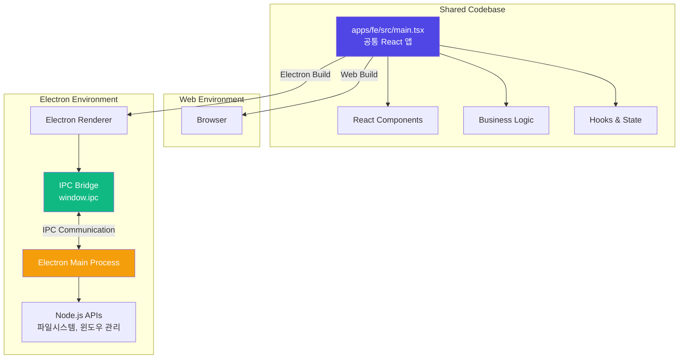
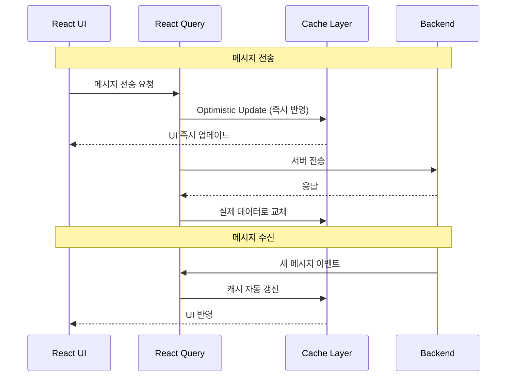
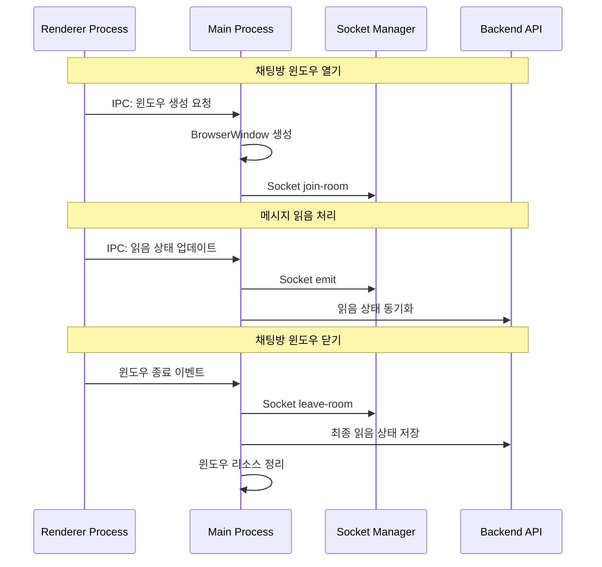
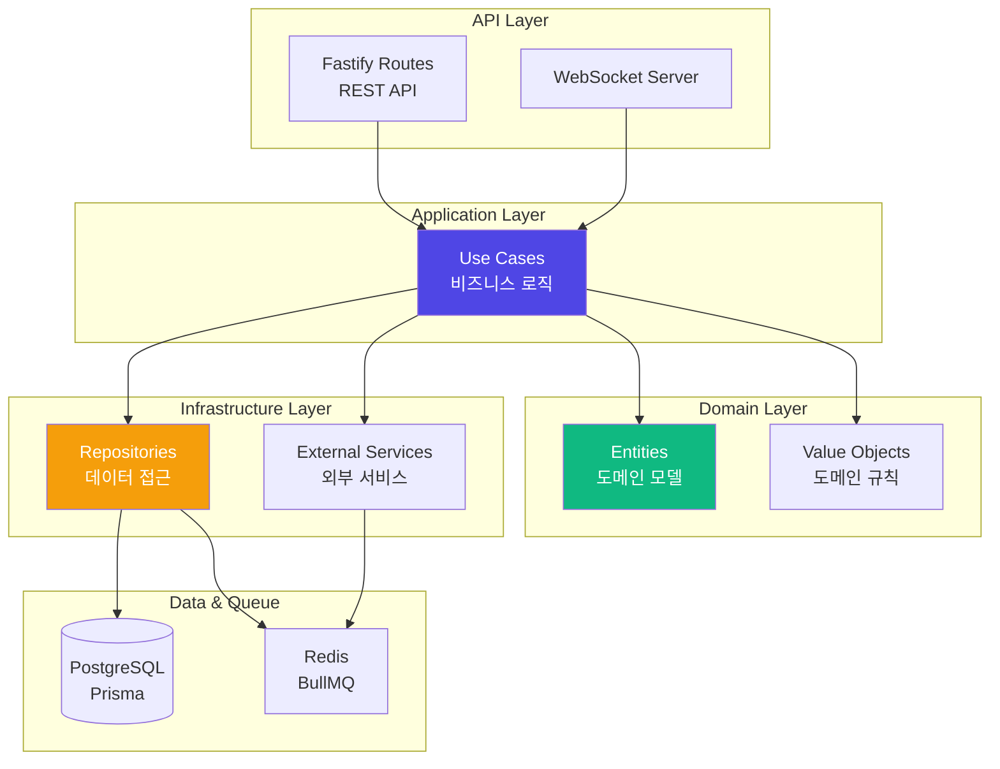
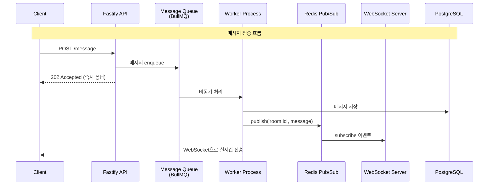
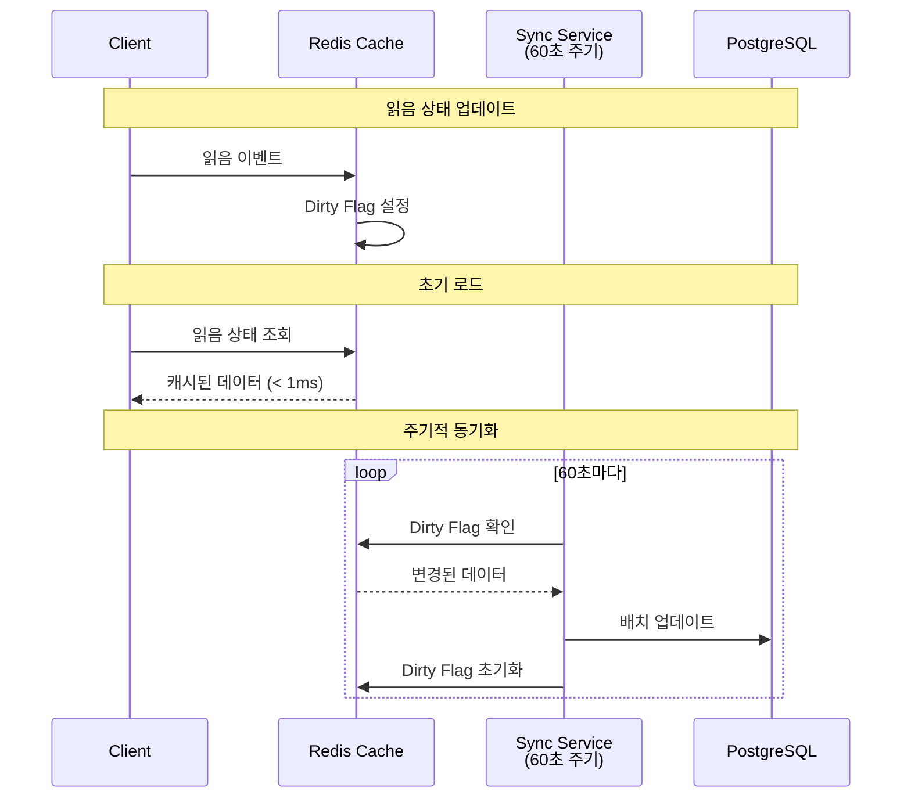
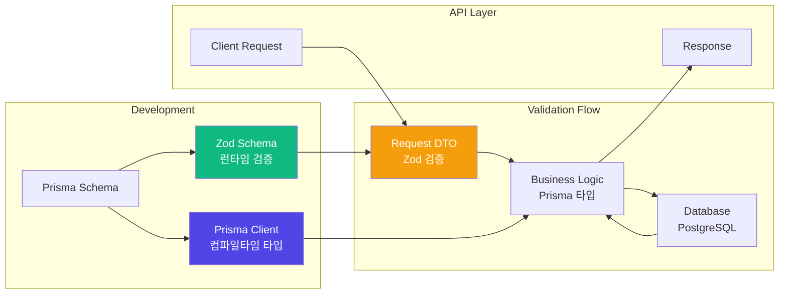

import { FileTree } from 'nextra/components'

# Sentinel-AI Messenger

병원 내부적으로 사용하기 위한 메신저 Desktop 앱 개발

## 1. 업무 개요

- 역할: 풀스택 개발
- 기술 스택: React, Fastify, BullMQ, Redis, Electron, PostgreSQL, AWS
- 업무 목표:
  - 병원에서 사용 가능한 메신저 앱 개발
  - 유저 베이스가 아닌 PC 베이스의 메신저 구조 구축
  - 실시간 대화 가능한 프로세스 구조 구축

## 2. 폴더 구조
 ```
 messaging/
├── apps/
│   ├── fe/             # Frontend
│   ├── desktop/        # Electron
│   ├── be/             # Backend API Server
│   └── ws/             # WebSocket Server
└── packages/
    ├── application/     # Use Cases (Business Logic)
    ├── domain/          # Domain Models & Entities
    ├── infrastructure/  # External Dependencies (DB, Queue, etc.)
    ├── db/              # Prisma Schema & Migrations
    ├── di/              # Dependency Injection Container
    └── shared/          # Shared Types & Constants
 ```
- **프로젝트 구조 개요**
  - pnpm workspace를 활용한 모노레포 구조
  - 계층형 아키텍처로 관심사 분리 (Domain, Application, Infrastructure)
  - 공통 로직 패키지화로 코드 재사용성 극대화

## 3. 기술 정리

### 3-1. Frontend

프론트엔드 아키텍처에서는 **성능 최적화**, **크로스 플랫폼 코드 공유**, **효율적인 상태 관리**를 핵심 목표로 설정했습니다. 특히 Desktop과 Web 환경을 단일 코드베이스로 관리하면서도 각 플랫폼의 강점을 최대한 활용하는 데 중점을 두었습니다.

#### Zero-Runtime CSS-in-JS: Vanilla Extract

기존 CSS-in-JS 라이브러리(styled-components, emotion 등)는 런타임에 스타일을 생성하여 초기 로딩 성능에 부정적인 영향을 미칩니다. 이를 해결하기 위해 **Vanilla Extract**를 도입하여 빌드 타임에 정적 CSS를 생성하는 전략을 선택했습니다.

```typescript
// src/styles/token.css.ts - 디자인 토큰 정의
export const colors = {
  primary: '#4F46E5',
  secondary: '#10B981',
  background: '#FFFFFF',
  // ...
};

export const spacing = {
  xs: '4px',
  sm: '8px',
  md: '16px',
  // ...
};

// src/components/atom/button/button.css.ts - 타입 세이프한 스타일
import { style } from '@vanilla-extract/css';
import { colors, spacing } from '../../../styles/token.css';

export const button = style({
  backgroundColor: colors.primary,
  padding: `${spacing.sm} ${spacing.md}`,
  borderRadius: '8px',
  ':hover': {
    opacity: 0.9,
  },
});
```

**성능 개선 효과**:
- **Zero Runtime Overhead**: 런타임에 스타일 계산 없음 → 초기 렌더링 속도 향상
- **Type-Safe Styling**: TypeScript로 스타일 작성 → 컴파일 타임 오류 검출
- **Automatic Tree Shaking**: 사용하지 않는 스타일 자동 제거 → 번들 크기 최소화
- **Critical CSS Extraction**: Vite가 필요한 CSS만 자동 번들링 → 초기 로딩 최적화

```typescript
// vite.config.ts
import { vanillaExtractPlugin } from '@vanilla-extract/vite-plugin';

export default defineConfig({
  plugins: [
    react(),
    vanillaExtractPlugin(), // 빌드 타임에 CSS 생성
  ],
});
```

#### Electron + Web 하이브리드 아키텍처

Desktop(Electron)과 Web 환경에서 **90% 이상의 코드를 공유**하면서도 플랫폼별 기능을 조건부로 활성화하는 아키텍처를 설계했습니다.




#### React Query 기반 데이터 캐싱 전략

대화방의 메시지 데이터를 효율적으로 관리하기 위해 **React Query**를 활용한 캐싱 및 무한 스크롤을 구현했습니다.




**성능 개선 효과**:
- **Instant Navigation**: 대화방 재진입 시 캐시된 데이터 즉시 표시 → UX 개선
- **Optimistic Updates**: 메시지 전송 시 UI 즉시 반영 → 반응성 향상
- **Bidirectional Scroll**: 필요한 메시지만 점진적 로드 → 초기 렌더링 시간 단축
- **Background Refetch**: 백그라운드에서 자동 동기화 → 최신 상태 유지

#### IPC 기반 Electron 라이프사이클 관리

Electron 환경에서는 **메인 프로세스에서 WebSocket 연결을 중앙 관리**하여 여러 채팅방 윈도우가 단일 소켓 연결을 공유하도록 설계했습니다.<br />
- **채팅창 소켓 통신 관련 IPC 흐름도**


**개발자가 수동으로 생명주기를 관리할 필요 없이** 윈도우 이벤트에 따라 소켓 연결과 읽음 상태가 자동으로 동기화됩니다. 

### 3-2. Backend

백엔드 아키텍처에서는 **Clean Architecture 기반 계층 분리**, **의존성 주입을 통한 유지보수성**, **비동기 메시지 처리**를 핵심으로 설계했습니다.

#### Clean Architecture + DDD 기반 계층 분리

**비즈니스 로직과 인프라 계층을 완전히 분리**하여 테스트 용이성과 유지보수성을 확보했습니다.



**계층 간 의존성을 인터페이스로 추상화**하여 각 계층이 독립적으로 변경 가능하도록 구성했습니다.
- **Domain**: 비즈니스 로직, 엔티티 정의 (외부 의존성 없음)
- **Application**: Use Case 구현, 서비스 계층
- **Infrastructure**: DB, Queue 등 외부 서비스 구현
- **API**: REST API, WebSocket 엔드포인트

#### Inversify 기반 의존성 주입 (DI/IoC)

**Inversify IoC 컨테이너**로 계층 간 의존성을 역전시켜 SOLID 원칙을 준수했습니다.

```typescript
// Lazy Proxy 패턴으로 환경변수 로딩 순서 보장
export const container = new Proxy({} as AppContainer, {
  get(_target, prop) {
    return getContainer()[prop as keyof AppContainer];
  },
});

// 모듈별 의존성 등록으로 관심사 분리
function createAppContainer(): AppContainer {
  const container = new Container({ defaultScope: 'Singleton' });
  registerDbModule(container);
  registerInfraModule(container, env);
  registerApplicationModule(container);
  return container;
}
```

**설계 효과**:
- **SOLID 원칙 준수**: 의존성 역전으로 상위 계층이 하위 구현에 의존하지 않음
- **테스트 가능성**: Mock 객체 주입으로 단위 테스트 작성 용이
- **싱글톤 관리**: 컨테이너가 서비스 인스턴스 생명주기 자동 관리
- **환경별 구성**: 개발/프로덕션 환경별 서비스 구현 교체 가능

#### 실시간 메시지 처리 아키텍처

**Fastify → BullMQ → Redis Pub/Sub → WebSocket**으로 이어지는 비동기 파이프라인을 구축했습니다.



**비동기 처리 전략**:
- **BullMQ**: 메시지 큐로 재시도, 우선순위 처리 지원
- **Redis Pub/Sub**: 여러 WebSocket 서버 간 이벤트 브로드캐스팅
- **즉시 응답**: REST API는 202 Accepted를 즉시 반환하고 백그라운드에서 처리

#### Repository Pattern으로 데이터 접근 추상화

**각 feature별 Repository**를 통해 도메인별 데이터 계층을 독립적으로 관리했습니다.

```typescript
// Application 계층이 정의한 인터페이스 (의존성 역전)
interface MessageRepo {
  save(message: Message): Promise<void>;
  findByConversation(id: string, cursor?: Cursor): Promise<Message[]>;
}

// Infrastructure 계층이 구현
@injectable()
class MessageRepoImpl implements MessageRepo {
  constructor(private prisma: PrismaClient) {}
  // ... Prisma를 사용한 구현
}
```

**장점**:
- **테스트 용이성**: Mock Repository로 단위 테스트 작성
- **구현 교체 가능**: ORM 교체 시 Application 계층 영향 없음
- **관심사 분리**: 비즈니스 로직은 데이터 저장 방식에 무관

#### 읽음 상태 동기화 전략 (Redis + PostgreSQL)

**2-Tier Caching 전략**으로 실시간 성능과 데이터 정합성을 동시에 달성했습니다.



**전략 효과**:
- **실시간 성능**: 읽음 상태는 Redis에서 즉시 읽기 (< 1ms)
- **DB 부하 감소**: 60초 배치 동기화로 쓰기 작업 90% 이상 감소

#### Prisma + Zod: 컴파일타임 & 런타임 타입 안전성

**Prisma ORM**과 **Zod**를 통합하여 컴파일타임과 런타임 모두에서 타입 안전성을 보장했습니다.



**Prisma 스키마 설계**:
```prisma
// 대화방 멤버와 읽음 상태
model ConversationMember {
  conversationId String
  pcId           String
  lastReadSeq    Int      @default(0)
  
  @@id([conversationId, pcId])
  @@index([conversationId, lastReadSeq])
}

// 메시지 seq 관리 (대화방별 auto-increment)
model Message {
  id             String @id @default(cuid())
  conversationId String
  seq            Int    // 대화방 내 순서 보장
  readCount      Int    @default(0)
  
  @@unique([conversationId, seq])
  @@index([conversationId, createdAt(sort: Desc)])
}
```

**Zod 통합 전략**:
```typescript
// Prisma 타입을 기반으로 Zod 스키마 생성
const CreateMessageSchema = z.object({
  conversationId: z.string().uuid(),
  content: z.string().min(1).max(5000),
  senderId: z.string(),
});

// API 요청 검증
app.post('/message', async (req, res) => {
  // Query 및 Body는 fastify-type-provider-zod로 fastify validator 단계에서 검증 
  const validated = CreateMessageSchema.parse(req.body); // 런타임 검증
  const result = await messageRepo.save(validated); // Prisma 타입 안전 쿼리
  res.send(result);
});
```

**통합 효과**:
- **이중 타입 안전성**: Prisma (컴파일타임) + Zod (런타임) 조합으로 타입 오류 사전 차단
- **자동 검증**: API 엔드포인트에서 요청/응답 자동 검증
