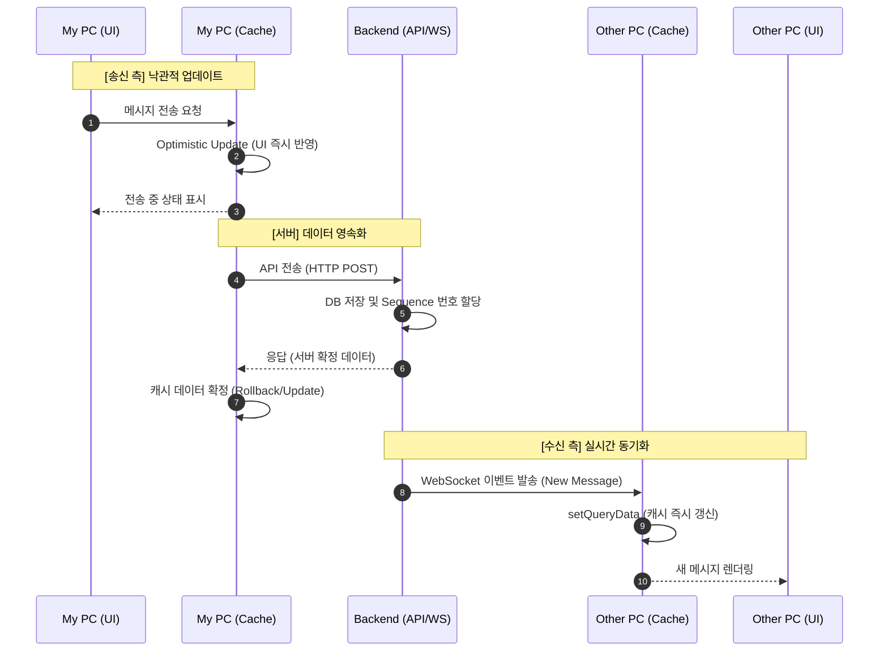
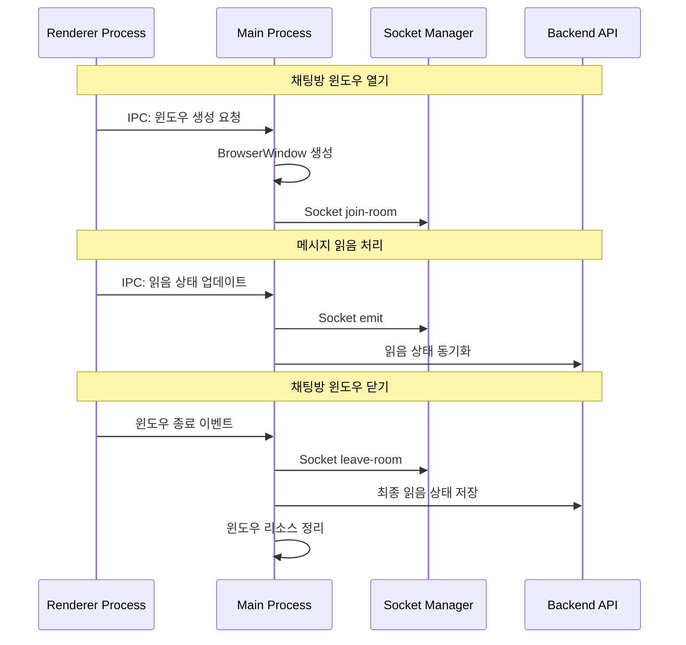
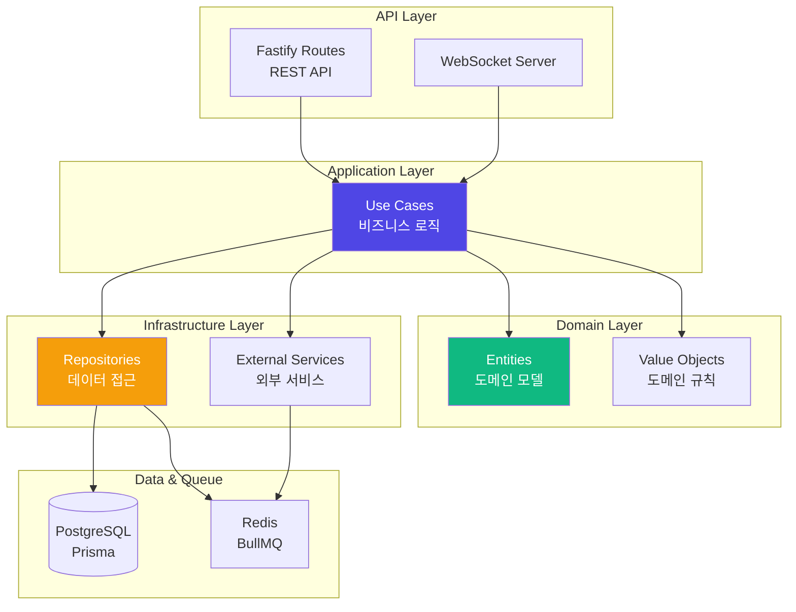
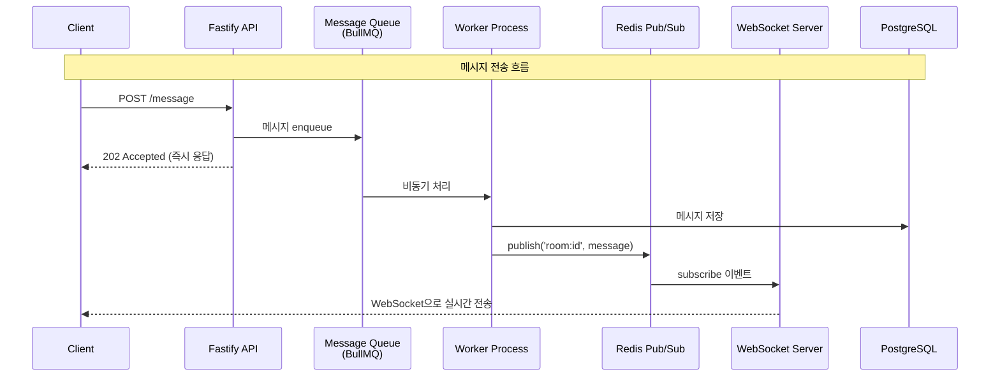
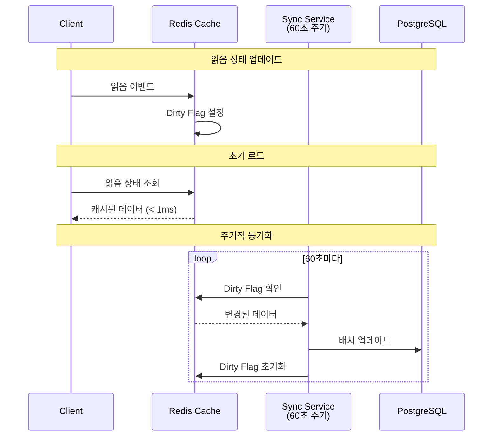
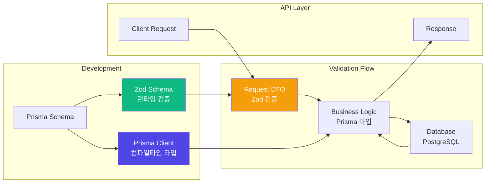

import { FileTree } from 'nextra/components'

# Sentinel-AI Messenger

본 프로젝트는 단일 병원을 대상으로 한 파일럿 단계로 시작되었으며,<br />
초기 단계에서는 보안 규제 준수보다 '메시지 전달의 신뢰성'과 '공유 PC 환경에서의 식별 시스템 최적화'를<br />
최우선 목표로 설정하여 개발되었습니다.

## 1. 업무 개요

- 역할: 풀스택 개발
- 기술 스택: React, Fastify, BullMQ, Redis, Electron, PostgreSQL, AWS
- 업무 목표:
  - "PC-Centric" 식별 체계 확립 (사용자 기반이 아닌 환경)
  - 확장성을 고려한 "플러그형" 아키텍처
  - 실시간 대화 가능한 프로세스 구조 구축

## 2. 폴더 구조
 ```
 messaging/
├── apps/
│   ├── fe/             # Frontend
│   ├── desktop/        # Electron
│   ├── be/             # Backend API Server
│   └── ws/             # WebSocket Server
├── infra/              # Deployment
└── packages/
    ├── application/     # Use Cases (Business Logic)
    ├── domain/          # Domain Models & Entities
    ├── infrastructure/  # External Dependencies (DB, Queue, etc.)
    ├── db/              # Prisma Schema & Migrations
    ├── di/              # Dependency Injection Container
    └── shared/          # Shared Types & Constants
 ```
- **프로젝트 구조 개요**
  - pnpm workspace를 활용한 모노레포 구조
  - 계층형 아키텍처로 관심사 분리 (Domain, Application, Infrastructure)
  - 공통 로직 패키지화로 코드 재사용성 극대화

## 3. 기술 정리

### 3-1. Frontend

프론트엔드 설계의 핵심 목표는 **"저사양 PC 환경에서도 점유율을 최소화하며 실시간 메신저의 반응성을 극대화하는 것"** 이었습니다.

#### High-Performance UX Engineering
- **Zero-Runtime CSS-in-JS (Vanilla Extract)** <br />메신저 특성상 수많은 메시지 버블이 실시간으로 생성되고 스크롤됩니다. 런타임에 스타일을 계산하는 기존 라이브러리는 대규모 리스트 렌더링 시 CPU 부하를 유발할 수 있어 이를 배제했습니다.
  - Runtime Overhead 제거: 빌드 타임에 모든 스타일을 정적 CSS로 추출하여, 브라우저가 스타일을 계산하는 Scripting Time을 0에 가깝게 단축했습니다.
  - 성능적 이점: 빈번한 UI 업데이트 상황에서도 Frame Drop을 방지하여 매끄러운 스크롤 경험을 제공합니다.
  - Type-Safe Styling: TypeScript 기반 스타일 정의를 통해 런타임 에러를 방지하고 개발 생산성을 높였습니다.
- **데이터 오케스트레이션 및 체감 속도 최적화** <br />네트워크 지연을 기술적으로 극복하여 사용자가 '기다림'을 느끼지 않게 하는 전략을 도입했습니다.
  - Optimistic Updates (낙관적 업데이트): 메시지 전송 시 서버 응답을 기다리지 않고 UI를 즉시 반영하여 네트워크 지연을 0으로 체감하게 설계했습니다.
  - Windowing 기법: 수천 개의 메시지 중 현재 보이는 영역만 렌더링하도록 처리하여 브라우저 메모리 점유율을 일정하게 유지했습니다.
- **리소스 점유 최적화: 저사양 및 상주형 환경 대응** <br />병원 PC 특성상 제한된 자원 내에서 안정적으로 앱이 돌아갈 수 있게 Electron의 구조를 설계 했습니다.
  - Single-Socket Architecture (Main Process 관리): 멀티 윈도우 환경에서 각 렌더러(채팅창, 설정창 등)에 각각 소켓을 연결할 경우 불필요한 PC 자원 낭비를 초래할 수 있습니다.
  이를 방지하기 위해 연결 주체를 렌더러가 아닌 Main Process로 단일화 하고, 로직을 단순화하여 복구 로직 및 주요 소켓 로직을 일원화 할 수 있었습니다.
  - IPC 지연 해소 및 직렬화 비용 최적화: IPC 페이로드를 최소화 하기 위해 **ID 기반 참조 전략**을 사용하였습니다. 메인 프로세스는 ID, Type만 전달하고 렌더러는 필요한 경우에 데이터를 요청하거나
  캐싱된 데이터를 받아 사용할 수 있게 설계하였습니다.
  

#### React Query 기반 데이터 캐싱 전략

대화방의 메시지 데이터를 효율적으로 관리하기 위해 **React Query**를 활용한 캐싱 및 무한 스크롤을 구현했습니다.




**성능 개선 효과**:
- **Instant Navigation**: 대화방 재진입 시 캐시된 데이터 즉시 표시 → UX 개선
- **Optimistic Updates**: 메시지 전송 시 UI 즉시 반영 → 반응성 향상
- **Bidirectional Scroll**: 필요한 메시지만 점진적 로드 → 초기 렌더링 시간 단축
- **Background Refetch**: 백그라운드에서 자동 동기화 → 최신 상태 유지

#### IPC 기반 Electron 라이프사이클 관리

Electron 환경에서는 **메인 프로세스에서 WebSocket 연결을 중앙 관리**하여 여러 채팅방 윈도우가 단일 소켓 연결을 공유하도록 설계했습니다.<br />
- **채팅창 소켓 통신 관련 IPC 흐름도**


**개발자가 수동으로 생명주기를 관리할 필요 없이** 윈도우 이벤트에 따라 소켓 연결과 읽음 상태가 자동으로 동기화됩니다. 

### 3-2. Backend

백엔드 아키텍처에서는 **Clean Architecture 기반 계층 분리**, **의존성 주입을 통한 유지보수성**, **비동기 메시지 처리**를 핵심으로 설계했습니다.

#### Clean Architecture + DDD 기반 계층 분리

**비즈니스 로직과 인프라 계층을 완전히 분리**하여 테스트 용이성과 유지보수성을 확보했습니다.



**계층 간 의존성을 인터페이스로 추상화**하여 각 계층이 독립적으로 변경 가능하도록 구성했습니다.
- **Domain**: 비즈니스 로직, 엔티티 정의 (외부 의존성 없음)
- **Application**: Use Case 구현, 서비스 계층
- **Infrastructure**: DB, Queue 등 외부 서비스 구현
- **API**: REST API, WebSocket 엔드포인트

#### Inversify 기반 의존성 주입 (DI/IoC)

**Inversify IoC 컨테이너**로 계층 간 의존성을 역전시켜 SOLID 원칙을 준수했습니다.

```typescript
// Lazy Proxy 패턴으로 환경변수 로딩 순서 보장
export const container = new Proxy({} as AppContainer, {
  get(_target, prop) {
    return getContainer()[prop as keyof AppContainer];
  },
});

// 모듈별 의존성 등록으로 관심사 분리
function createAppContainer(): AppContainer {
  const container = new Container({ defaultScope: 'Singleton' });
  registerDbModule(container);
  registerInfraModule(container, env);
  registerApplicationModule(container);
  return container;
}
```

**설계 효과**:
- **SOLID 원칙 준수**: 의존성 역전으로 상위 계층이 하위 구현에 의존하지 않음
- **테스트 가능성**: Mock 객체 주입으로 단위 테스트 작성 용이
- **싱글톤 관리**: 컨테이너가 서비스 인스턴스 생명주기 자동 관리
- **환경별 구성**: 개발/프로덕션 환경별 서비스 구현 교체 가능

```typescript
// 유닛 테스트 단순화

// 실 구현부
@injectable()
export class SendMessageUseCase {
  constructor(
    @inject(TYPES.MessageRepo) private messageRepo: IMessageRepo // 인터페이스에 의존
  ) {}

  async execute(content: string) {
    if (!content) throw new Error("내용 비어있음");
    return await this.messageRepo.save(content);
  }
}

// 테스트 케이스
it("DB 없이도 비즈니스 로직 테스트 가능", async () => {
  const container = new Container();
  const mockRepo = { save: jest.fn().mockResolvedValue(true) };

  // 실제 DB 대신 Mock 바인딩
  container.bind<IMessageRepo>(TYPES.MessageRepo).toConstantValue(mockRepo);
  const useCase = container.resolve(SendMessageUseCase);

  const result = await useCase.execute("Hello");
  expect(result).toBe(true);
});
```

#### 실시간 메시지 처리 아키텍처

**Fastify → BullMQ → Redis Pub/Sub → WebSocket**으로 이어지는 비동기 파이프라인을 구축했습니다.



**비동기 처리 전략**:
- **BullMQ**: 메시지 큐로 재시도, 우선순위 처리 지원
- **Redis Pub/Sub**: 여러 WebSocket 서버 간 이벤트 브로드캐스팅
- **즉시 응답**: REST API는 202 Accepted를 즉시 반환하고 백그라운드에서 처리

#### Repository Pattern으로 데이터 접근 추상화

**각 feature별 Repository**를 통해 도메인별 데이터 계층을 독립적으로 관리했습니다.

```typescript
// Application 계층이 정의한 인터페이스 (의존성 역전)
interface MessageRepo {
  save(message: Message): Promise<void>;
  findByConversation(id: string, cursor?: Cursor): Promise<Message[]>;
}

// Infrastructure 계층이 구현
@injectable()
class MessageRepoImpl implements MessageRepo {
  constructor(private prisma: PrismaClient) {}
  // ... Prisma를 사용한 구현
}
```

**장점**:
- **테스트 용이성**: Mock Repository로 단위 테스트 작성
- **구현 교체 가능**: ORM 교체 시 Application 계층 영향 없음
- **관심사 분리**: 비즈니스 로직은 데이터 저장 방식에 무관

#### 읽음 상태 동기화 전략 (Redis + PostgreSQL)

**2-Tier Caching 전략**으로 실시간 성능과 데이터 정합성을 동시에 달성했습니다.



**전략 효과**:
- **실시간 성능**: 읽음 상태는 Redis에서 즉시 읽기 (< 1ms)
- **DB 부하 감소**: 60초 배치 동기화로 쓰기 작업 90% 이상 감소

**🔍 한계점 및 개선 방안: Reliability vs Performance** <br />
현재의 Write-Behind 전략은 극적인 성능 향상을 가져왔으나, 시스템 장애 시 최대 60초 분량의 읽음 데이터 유실 가능성이 존재합니다.

* **Trade-off 결정 근거**: 메신저 서비스에서 '읽음 상태'는 메시지 본문보다 상대적으로 데이터 중요도가 낮다고 판단, 시스템 가용성과 성능을 위해 Eventual Consistency 모델을 선택했습니다.
* **차기 개선안**: 
    1. **Redis Streams 도입**: Dirty Flag 방식의 레이스 컨디션을 해결하고 이벤트 기반의 안정적인 동기화 파이프라인 구축.
    2. **Check-and-Set 전략**: DB 업데이트 시 시퀀스 번호 비교 로직을 추가하여 데이터 역전 현상 방지.

#### Prisma + Zod: 컴파일타임 & 런타임 타입 안전성

**Prisma ORM**과 **Zod**를 통합하여 컴파일타임과 런타임 모두에서 타입 안전성을 보장했습니다.



**Prisma 스키마 설계**:
```prisma
// 대화방 멤버와 읽음 상태
model ConversationMember {
  conversationId String
  pcId           String
  lastReadSeq    Int      @default(0)
  
  @@id([conversationId, pcId])
  @@index([conversationId, lastReadSeq])
}

// 메시지 seq 관리 (대화방별 auto-increment)
model Message {
  id             String @id @default(cuid())
  conversationId String
  seq            Int    // 대화방 내 순서 보장
  readCount      Int    @default(0)
  
  @@unique([conversationId, seq])
  @@index([conversationId, createdAt(sort: Desc)])
}
```

**Zod 통합 전략**:
```typescript
// Prisma 타입을 기반으로 Zod 스키마 생성
const CreateMessageSchema = z.object({
  conversationId: z.string().uuid(),
  content: z.string().min(1).max(5000),
  senderId: z.string(),
});

// API 요청 검증
app.post('/message', async (req, res) => {
  // Query 및 Body는 fastify-type-provider-zod로 fastify validator 단계에서 검증 
  const validated = CreateMessageSchema.parse(req.body); // 런타임 검증
  const result = await messageRepo.save(validated); // Prisma 타입 안전 쿼리
  res.send(result);
});
```

**통합 효과**:
- **이중 타입 안전성**: Prisma (컴파일타임) + Zod (런타임) 조합으로 타입 오류 사전 차단
- **자동 검증**: API 엔드포인트에서 요청/응답 자동 검증
